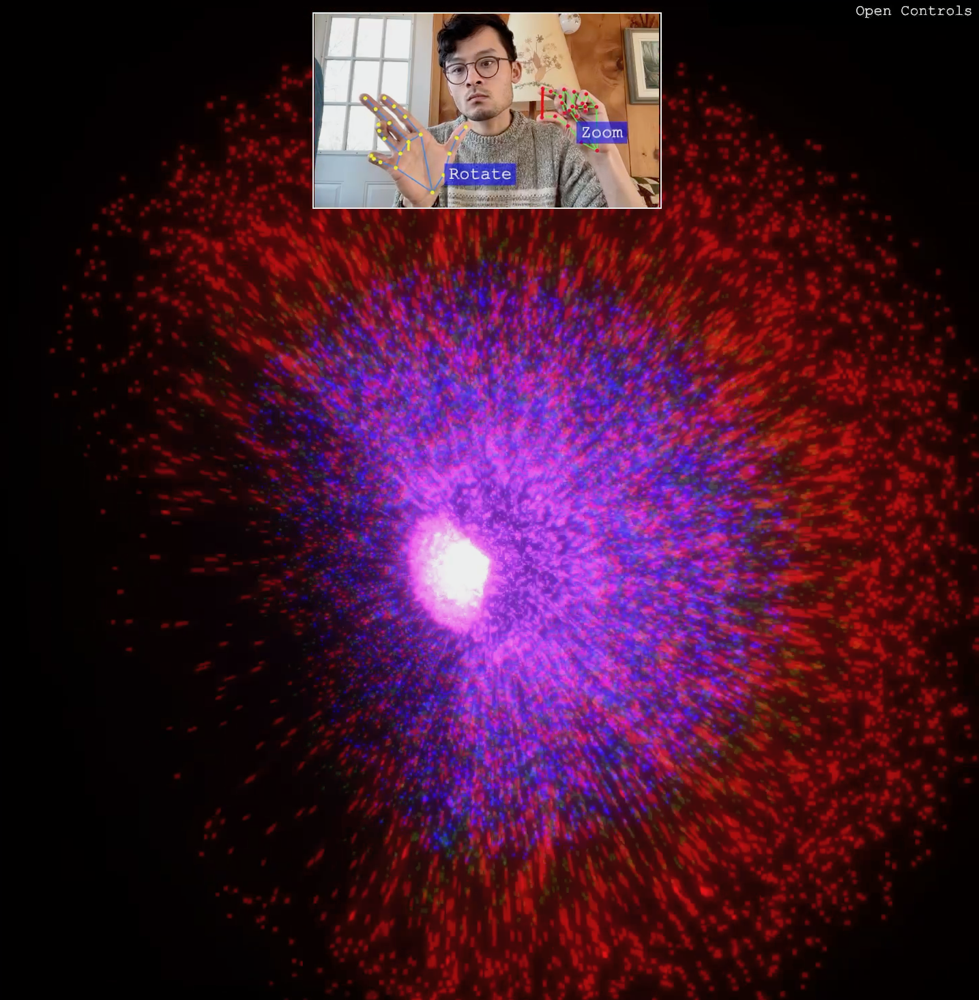

# Stark Shapes

An interactive 3D particle visualization controlled through hand gestures.

[Live Demo](https://collidingscopes.github.io/stark-shapes/) | [Video Example](https://www.instagram.com/reel/DH9oY0sR4sJ/)

## Features

- Control the camera with your hands
- Right hand: pinch to zoom in/out
- Left hand: rotate to orbit the camera
- Clap your hands to change to the next pattern
- 3D geometric patterns include: Cube, Sphere, Spiral, Helix, Galaxy, and more

## Technology

Built with Three.js and MediaPipe Hand Tracking.

## Related Projects

You might also like some of my other open source projects:

- [Threejs shape creator](https://collidingScopes.github.io/shape-creator-tutorial) - create / control 3D shapes with threejs and MediaPipe computer vision
- [Threejs hand tracking tutorial](https://collidingScopes.github.io/threejs-handtracking-101) - Basic hand tracking setup with threejs and MediaPipe computer vision
- [Particular Drift](https://collidingScopes.github.io/particular-drift) - Turn photos into flowing particle animations
- [Liquid Logo](https://collidingScopes.github.io/liquid-logo) - Transform logos and icons into liquid metal animations
- [Video-to-ASCII](https://collidingScopes.github.io/ascii) - Convert videos into ASCII pixel art

## Contact

- Instagram: [@stereo.drift](https://www.instagram.com/stereo.drift/)
- Twitter/X: [@measure_plan](https://x.com/measure_plan)
- Email: [stereodriftvisuals@gmail.com](mailto:stereodriftvisuals@gmail.com)
- GitHub: [collidingScopes](https://github.com/collidingScopes)

## Donations

If you found this tool useful, feel free to buy me a coffee. 

My name is Alan, and I enjoy building open source software for computer vision, games, and more. This would be much appreciated during late-night coding sessions!

